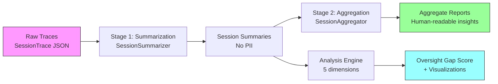

# AgentLens

**Privacy-preserving observability for LLM agents in the wild.**

AgentLens is an open-source framework for understanding what LLM agents actually
do in practice — what tasks they automate, how much human oversight they receive,
where they fail, and whether safeguards are proportional to the stakes — all without
exposing any raw user data.

Inspired by Anthropic's [Clio](https://www.anthropic.com/research/clio) platform
for privacy-preserving analysis of AI usage.

## Why AgentLens?

As AI shifts from chatbots to autonomous agents, we need new tools to maintain
oversight. Static benchmarks tell us what agents *can* do; AgentLens tells us what
they *actually* do and whether anyone is watching.

Our analysis of 151 agent sessions found:
- **61% of actions are fully autonomous** — taken without any human confirmation
- **8.5% failure rate, 100% silent** — agents fail without surfacing errors to users
- **8.9% of high-stakes actions go unescalated** — the oversight gap is real
- **7 sessions scored maximum oversight risk** — all from the task management domain

## Quick Start

### Installation

```bash
pip install agentlens
```

### Instrument an agent (3 lines of code)

```python
from agentlens import AgentTracer, TaskCategory, SessionOutcome

tracer = AgentTracer(
    agent_type="my_agent",
    task_category=TaskCategory.CODE_REVIEW,
    model_used="claude-sonnet-4-20250514",
)
tracer.start_session(task_description="Review authentication PR")

# ... your agent code, using tracer.record_action() or tracer.action() context manager ...
with tracer.action(action_type=ActionType.READ, autonomy_level=AutonomyLevel.FULL_AUTO,
                   raw_input="Read PR diff") as ctx:
    diff = fetch_pr_diff()
    ctx.set_output_summary("Read 247-line diff across 12 files")

trace = tracer.end_session(outcome=SessionOutcome.COMPLETED)
```

### Run the privacy-preserving analysis pipeline

```bash
python -m agentlens run --traces-dir ./traces --output ./reports
```

### Run in mock mode (no API calls)

```bash
python -m agentlens run --traces-dir ./traces --output ./reports --mock
```

## Architecture



The framework has three layers:
1. **Raw Traces** — structured action logs with hashed inputs (never store raw data)
2. **Session Summaries** — LLM-generated abstractions stripping any remaining PII
3. **Aggregate Reports** — cross-session insights safe to share with researchers

## Key Features

- **Automatic trace capture** via SDK with LangChain integration
- **Privacy by design** — raw user data is never stored; only hashes and LLM summaries
- **Clio-inspired aggregation** — two-stage LLM pipeline produces human-readable insights
- **Rigorous privacy validation** — PII leakage tests, re-identification attacks, utility-privacy trade-offs
- **Five-dimensional analysis** — autonomy profiling, failure taxonomy, tool usage, escalation patterns, oversight gap scoring
- **The Oversight Gap Score** — a novel metric quantifying whether safeguards are proportional to stakes

## Dataset

Our trace dataset is available locally in hf_dataset/.

## Results

### Autonomy Distribution by Agent Type


Code reviewers and research assistants operate at ~63% full autonomy. Task managers
are slightly lower at 56% — but produce the highest oversight gap scores when they
do act autonomously.

### Oversight Gap Score Distribution


87% of sessions have an oversight gap score of 0 (adequate oversight). But 7 sessions
(4.6%) scored 1.0 — the maximum risk level — all involving task managers taking
consequential write/execute actions without any human confirmation step.

### Oversight Gap vs. Failure Rate


Sessions with high oversight gap scores show a slightly *negative* correlation with
failures (r = -0.115), suggesting agents don't fail more when operating autonomously —
they fail *silently*, making the gap harder to detect.

## Citation

If you use AgentLens in your research, please cite:

```bibtex
@misc{mediratta2026agentlens,
  title={AgentLens: Privacy-Preserving Observability for LLM Agents},
  author={Mediratta, Anupam},
  year={2026},
  url={https://github.com/anupamme/AgentLens},
}
```

## Documentation

- [Schema Design](docs/schema.md) — design philosophy, field reference, autonomy taxonomy
- [Trace Examples](docs/examples.md) — annotated walkthroughs of sample traces
- [Research Write-Up](paper/agentlens_writeup.md) — full findings and methodology

## Project Structure

```
src/agentlens/
    schema/         # Pydantic trace models and enums
    sdk/            # Tracing instrumentation (AgentTracer, ActionContext, LangChain)
    aggregation/    # Two-stage LLM aggregation pipeline
    analysis/       # Five-dimensional oversight analysis engine
    privacy/        # PII leakage, re-identification, and utility-privacy validation
    workloads/      # Synthetic workload generation for testing
    utils/          # Hashing and timestamp utilities
tests/              # Test suite (17 test files)
scripts/            # Utility scripts (schema export, HuggingFace dataset prep)
paper/              # Research write-up
docs/               # Documentation
examples/           # Example agent implementations
```

## License

Apache 2.0
