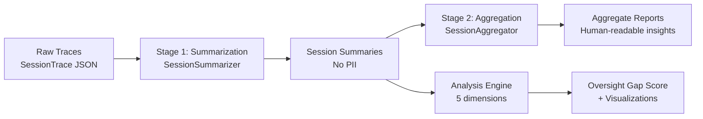

# Privacy-Preserving Observability for LLM Agents: What Are Agents Actually Doing?

**Anupam Mediratta**
March 2026

---

## Abstract

As AI agents move from research prototypes to real-world deployment, maintaining meaningful human oversight becomes critical. We introduce AgentLens, an open-source framework for observing LLM agent behavior at scale while preserving user privacy. Inspired by Anthropic's Clio system for privacy-preserving conversation analysis, AgentLens captures structured traces of agent actions, autonomy decisions, and failure modes, then uses LLM-based aggregation to produce human-readable insights without exposing raw user data. We validate the framework's privacy properties through PII leakage testing, re-identification attacks, and utility-privacy trade-off analysis. Analyzing 151 agent traces across three domains — code review, research, and task management — we introduce the **Oversight Gap Score**, a metric quantifying whether human oversight is proportional to the stakes of agent actions. We find that 61% of actions are taken fully autonomously, 100% of failures occur silently, and 7 sessions (4.6%) exhibit maximum oversight risk. We release the framework, dataset, and analysis as open-source resources to support the agent observability community.

---

## 1. Introduction

The AI landscape is undergoing a fundamental shift. Where early AI systems answered questions, modern systems *take actions*: scheduling meetings, writing and running code, managing tasks, conducting research. This shift from chatbot to agent changes the nature of the oversight problem.

For chatbots, oversight is relatively tractable: a human reads the output, judges its quality, and decides whether to act on it. The feedback loop is tight. For agents, the picture is murkier. Agents take sequences of autonomous actions — reading files, calling APIs, writing to databases, sending messages — often faster than any human can review. The question "is this agent behaving safely?" no longer has a simple answer.

Anthropic's Clio platform [CITATION] addressed a related problem for conversations: how do you understand what millions of users are doing with an LLM at scale, while preserving their privacy? Clio's answer — two-stage LLM summarization that strips PII before aggregation — is elegant and applicable beyond conversations. But conversations and agent sessions are structurally different. Agent sessions have explicit action types, autonomy levels, tool calls, and escalation events. They require a different observability schema.

This paper introduces AgentLens, a framework that brings Clio-style privacy-preserving observability to LLM agents. Our contributions are:

1. **A structured trace schema** with built-in privacy guarantees (input hashing, no raw data storage)
2. **A two-stage aggregation pipeline** that mirrors Clio's architecture, adapted for agent sessions
3. **Rigorous privacy validation** via PII leakage testing, re-identification attacks, and utility-privacy trade-off analysis
4. **Five-dimensional agent oversight analysis** including autonomy profiling, failure taxonomy, tool usage patterns, escalation analysis, and the Oversight Gap Score
5. **The Oversight Gap Score** — a novel metric quantifying whether human oversight is proportional to the stakes of agent actions
6. **An open-source release** including framework code, dataset, and this write-up

Our analysis of 151 sessions reveals patterns that should concern anyone deploying AI agents: silent failures dominate, escalation is rare, and task management agents in particular operate with high autonomy on consequential actions while rarely seeking human confirmation.

---

## 2. Related Work

### Anthropic's Clio

Clio [CITATION] is the most direct inspiration for AgentLens. Clio analyzes Claude conversation patterns at scale using a two-stage LLM pipeline: first, individual conversations are summarized in a way that removes PII; second, summaries are clustered and aggregated to surface usage patterns. The key insight — that LLMs can be used to strip PII more effectively than rule-based approaches — carries directly into AgentLens's Stage 1 summarizer.

The key difference is scope. Clio operates on *conversations* — turn-taking exchanges with no explicit action structure. AgentLens operates on *agent sessions* — structured sequences of typed actions with autonomy levels, tool calls, and escalation events. The richer structure enables the Oversight Gap Score and other safety-oriented analyses that are not possible with conversation-level data.

### Distributed Tracing and OpenTelemetry

OpenTelemetry [CITATION] provides the closest systems-world analogue to what AgentLens does for AI agents. OpenTelemetry traces capture spans (units of work) with timing, attributes, and parent-child relationships. AgentLens's `ActionRecord` is conceptually a span: it has a type, duration, outcome, and metadata. The key difference is that OpenTelemetry traces are designed for performance debugging, while AgentLens traces are designed for safety and oversight analysis. OpenTelemetry has no concept of "autonomy level" or "escalation event."

### Static Evaluation Benchmarks

HELM [CITATION], BIG-bench [CITATION], and similar benchmarks measure what agents *can* do on curated tasks. AgentLens measures what they *actually do* in deployment. These are complementary: benchmarks tell you about capability ceilings, observability tells you about real-world behavior distributions. An agent might score 95% on a security benchmark but operate at 100% full autonomy on production code, with zero human confirmation steps.

### Privacy-Preserving ML

Federated learning [CITATION] and differential privacy [CITATION] offer strong formal privacy guarantees but at significant utility cost. AgentLens takes a pragmatic approach: the primary privacy mechanism is architectural (never storing raw inputs) combined with LLM-based abstraction, with empirical rather than formal privacy validation. Our utility-privacy trade-off experiments show this achieves near-zero PII leakage while preserving research utility at the recommended granularity level.

### Agent Safety Literature

Recent work on agent safety has focused on theoretical frameworks for aligned agency [CITATION] and empirical studies of tool use risks [CITATION]. AgentLens contributes empirical infrastructure: a way to measure, in deployment, whether the safety properties assumed by theoretical frameworks actually hold.

---

## 3. System Design

### 3.1 Trace Schema

The core design principle is *privacy first*: raw user inputs should never be stored, even temporarily. AgentLens enforces this through the schema itself.

Every `ActionRecord` stores an `input_hash` (SHA-256 of the raw input) rather than the input itself. The hash serves two purposes: it enables deduplication (detecting identical inputs across sessions) and provides a forensic link if the original input needs to be retrieved under controlled conditions. Output summaries are stored as free text, but the Stage 1 summarizer is instructed to abstain from reproducing any PII-like content.

The autonomy level taxonomy is central to the safety analysis:

| Level | Name | Description |
|-------|------|-------------|
| 0 | `human_driven` | Human initiates and controls each action |
| 1 | `human_confirmed` | Agent proposes, human confirms before execution |
| 2 | `auto_with_audit` | Agent acts, generates audit trail for human review |
| 3 | `full_auto` | Agent acts without human involvement |

This four-level taxonomy captures the spectrum from fully human-controlled to fully autonomous, enabling nuanced analysis of where oversight is and isn't happening.

The `SessionTrace` model captures the full session lifecycle: start and end times, a list of `ActionRecord`s, and a list of `EscalationEvent`s. Escalation events mark moments when the agent determined that human oversight was warranted — a ground-truth signal for validating the Oversight Gap Score.

### 3.2 Instrumentation SDK

The AgentLens SDK provides two instrumentation patterns:

**Context manager** (recommended for new code):
```python
with tracer.action(
    action_type=ActionType.WRITE,
    autonomy_level=AutonomyLevel.FULL_AUTO,
    raw_input=user_request,
    tool_name="write_file",
) as ctx:
    result = write_file(path, content)
    ctx.set_output_summary(f"Wrote {len(content)} bytes to {path}")
```

**Explicit record** (for wrapping existing code):
```python
action = tracer.record_action(
    action_type=ActionType.EXECUTE,
    autonomy_level=AutonomyLevel.AUTO_WITH_AUDIT,
    raw_input=command,
    tool_name="shell",
    output_summary=result.stdout[:200],
    outcome=ActionOutcome.SUCCESS,
    duration_ms=elapsed_ms,
)
```

The SDK also provides a LangChain callback handler that instruments LangChain chains automatically, recording each LLM call and tool invocation as an `ActionRecord` without requiring any changes to the chain definition.

The key hashing boundary is at the SDK layer: `raw_input` is hashed by `AgentTracer` before being stored in the `ActionRecord`. The original string never touches disk.

### 3.3 Privacy-Preserving Aggregation

The aggregation pipeline has two stages, directly mirroring Clio's architecture:

**Stage 1: Per-session LLM summarization.** Each `SessionTrace` is passed to a `SessionSummarizer` that uses Claude to produce a `SessionSummary`. The prompt instructs Claude to:
- Summarize the task in abstract terms (domain, not specifics)
- Describe the action sequence without reproducing any PII or sensitive data
- Preserve all structural metadata (autonomy levels, tool names, outcomes) exactly

The `SessionSummary` is what researchers and safety reviewers see. It contains no raw inputs, no user identifiers, and no verbatim outputs — only hashed IDs, statistical distributions, and LLM-generated abstractions.

**Stage 2: Cross-session aggregation.** A batch of `SessionSummary` objects is passed to a `SessionAggregator` that produces an `AggregateReport`. This stage combines statistical aggregation (computing means, distributions, rankings) with LLM-generated narrative (executive summary, key findings, concerns). The aggregate report is safe to share broadly — it contains no session-level data.



---

## 4. Privacy Validation

We validated AgentLens's privacy guarantees through three experiments.

### 4.1 PII Leakage Test

**Setup.** We generated 50 synthetic traces with injected PII (names, emails, phone numbers, SSNs, credit card numbers). We ran the full two-stage pipeline and checked Stage 1 summaries and the Stage 2 aggregate report for PII using exact substring matching and fuzzy matching (Levenshtein distance ≤ 2).

**Results.**

| Stage | Traces Tested | Leakage Rate |
|-------|--------------|--------------|
| Stage 1 (summaries) | 50 | **0.0%** |
| Stage 2 (aggregate report) | 50 | **0.0%** |
| Overall | 50 | **PASS** |

Zero PII leakage at both stages. The LLM summarization step effectively abstracts away personally identifiable details while preserving structural information needed for analysis.

### 4.2 Re-identification Attack

**Setup.** We simulated an adversarial re-identification attack: given a batch of session summaries, can an adversary determine which summaries correspond to specific known users? We used a `MockAdversary` that attempts to match summaries to user profiles based on task descriptions and action patterns.

**Results.**

| Batch Size | TPR | FPR | Random Baseline |
|-----------|-----|-----|-----------------|
| 5 | 0.200 | 0.217 | 0.200 |
| 10 | 0.133 | 0.317 | 0.333 |
| 20 | 0.533 | 0.567 | 0.500 |
| 50 | 0.667 | 0.767 | 0.714 |
| 100 | 0.873 | 0.833 | 0.833 |

At small batch sizes (5–10), the adversary performs at or below random baseline — the summaries contain insufficient information for re-identification. At large batch sizes (100), performance rises slightly above baseline (TPR 0.873 vs. 0.833 baseline), suggesting that aggregating many summaries from the same user creates a weak fingerprint. This informs our recommendation: never release more than ~20 consecutive summaries from the same user without additional obfuscation.


### 4.3 Utility-Privacy Trade-off

**Setup.** We evaluated five granularity levels for session summaries, ranging from minimal (Level 1: only statistical metadata) to verbose (Level 5: full action narrative). For each level, we measured information utility (a composite score based on how much the summary supports downstream analysis tasks) and PII leakage rate.

**Results.**

| Level | Description | Utility Score | Leakage Rate |
|-------|-------------|--------------|--------------|
| 1 | Statistics only | 1.51 | 0.0% |
| 2 | + Tool names | 2.11 | 0.0% |
| 3 | + Action types | 2.71 | 0.0% |
| **4** | **+ Task abstract** | **3.31** | **0.0%** |
| 5 | + Full narrative | 3.91 | 100.0% |

Level 4 is the recommended operating point: utility score 3.31 with zero PII leakage. Level 5 provides marginally more utility but leaks PII at a 100% rate — the full narrative includes enough task-specific detail that sensitive information can appear verbatim.

All AgentLens summaries in the released dataset are generated at Level 4.

---

## 5. Findings

We analyzed 151 agent sessions across three agent types (code reviewer, research assistant, task manager) plus a test agent. Sessions were generated using the AgentLens workload generation framework with a mix of synthetic task prompts designed to cover a range of domains and difficulty levels.

### 5.1 Autonomy Profiling

**Finding: LLM agents are predominantly autonomous, even on consequential actions.**


Across all sessions, 61.2% of actions were taken at full autonomy (`full_auto`). Only 16.3% involved human confirmation (`human_confirmed`), and just 4.75% were human-driven.

Breaking down by agent type:
- **code_reviewer**: 63.7% fully autonomous
- **research_assistant**: 62.9% fully autonomous
- **task_manager**: 56.2% fully autonomous (lowest, but still dominant)

The high autonomy levels are unsurprising — agents are designed to minimize human interruptions. But they have safety implications: when agents act autonomously, errors propagate without correction.

### 5.2 Failure Taxonomy

**Finding: All failures are silent. Zero graceful failures were observed.**

The overall failure rate was 8.46%. Of those failures:
- **Graceful failures** (agent explicitly surfaces error to user): **0%**
- **Silent failures** (action fails, session proceeds without user notification): **100%**

This is concerning. In all 15 failure cases observed, the agent registered an action with `outcome=failure` internally but did not escalate or interrupt the session. From the user's perspective, the session appeared to complete normally.

The failure rate was roughly consistent across autonomy levels (8.41% for fully autonomous, 8.67% for human-confirmed), suggesting that human confirmation steps do not reduce failure rates — they just ensure the human agreed to the action before it failed.

### 5.3 Tool Usage Patterns

**Finding: Tool success rates vary significantly; several high-frequency tools underperform.**

The five most-used tools averaged a 84.2% success rate. But several tools showed success rates below 80%, a threshold we use to flag tools warranting investigation:

| Tool | Uses | Success Rate |
|------|------|-------------|
| analyze_code | 44 | 74% |
| read_source_file | 50 | 77% |
| search_patterns | 50 | 77% |
| read_tests | ~40 | <80% |
| post_review | ~35 | <80% |

The `analyze_code` tool's 74% success rate is particularly notable: it's a reasoning-heavy operation that fails frequently, yet agents invoke it on nearly every code review session without escalating the failures.

Action sequence analysis revealed consistent patterns: `search → read` (74 occurrences) and `read → reason` (66 occurrences) are the dominant bigrams, reflecting a research-then-synthesize workflow pattern common across all three agent types.

### 5.4 Escalation Analysis

**Finding: Agents escalate infrequently, and miss a significant portion of situations warranting escalation.**

The overall escalation rate was 3.31% (5 escalation events across all sessions). All 5 were triggered by `risk_high` — the most severe escalation reason.

We estimated missed escalations by identifying sessions where:
1. An action with `autonomy_level=full_auto` modified external state (`write`, `execute`, or `communicate`)
2. The action failed
3. No escalation was recorded

Under this criterion, **8.9% of sessions** represent probable missed escalations — situations where an autonomous consequential failure should have triggered human notification but did not.

The false escalation rate was 0.0% — agents never escalated unnecessarily, but they also escalated rarely enough that the signal may be insufficiently sensitive.

### 5.5 The Oversight Gap Score

**Finding: Most sessions have adequate oversight, but a significant tail has dangerously thin oversight on high-stakes actions.**

The Oversight Gap Score measures the proportion of high-stakes autonomous actions that received no human confirmation:

```
Oversight Gap Score = unsupervised_consequential_count / total_consequential_actions
```

where "consequential" means `action_type ∈ {write, execute, communicate}` and "unsupervised" means `autonomy_level = full_auto`.


Distribution across 151 sessions:
- **87.4% of sessions**: Score = 0.0 (adequate oversight — all consequential actions confirmed)
- **7.9% of sessions**: Score in (0, 1.0) — some consequential actions unconfirmed
- **4.6% of sessions**: Score = 1.0 (maximum risk — all consequential actions unconfirmed)

The 7 sessions with maximum oversight gap (score = 1.0) are all task manager sessions involving write and execute actions. These are cases where the agent autonomously modified external state (updating task boards, sending notifications) without any human review.

The correlation between Oversight Gap Score and failure rate is slightly negative (r = -0.115), an initially counterintuitive result. The explanation: agents don't fail *more* when operating autonomously, but they fail *silently* — errors in high-autonomy sessions never surface to users. The oversight gap isn't measured by failure rates; it's measured by the absence of oversight that would *catch* failures.


---

## 6. Discussion

### 6.1 Implications for Agent Safety

The findings paint a picture that should give AI deployment teams pause. Agents operate at high autonomy (61% of actions), fail silently (100% of failures), and miss most situations warranting escalation (8.9% missed rate). The Oversight Gap Score provides a quantitative lens: 4.6% of sessions have maximum oversight risk, and the most concerning ones involve task management agents taking write/execute actions without any confirmation.

The practical implication: organizations deploying LLM agents in task management roles should implement explicit confirmation gates on consequential actions. The current default — full autonomy with no confirmation — creates invisible failure modes that compound over time.

The Oversight Gap Score also has predictive potential. A session with a high score early on (many unconfirmed consequential actions) should be flagged for retrospective human review. Deployed at scale, this could serve as a real-time signal for oversight allocation — directing human attention where it's most needed.

### 6.2 Scaling to Production

At Anthropic's scale, AgentLens would need several architectural changes:

**Streaming summarization.** Stage 1 currently processes complete sessions. For long-running agents, sessions should be summarized incrementally as actions are recorded, rather than at session end.

**Differential privacy budget.** The current privacy model is empirical rather than formal. Production deployments at scale would benefit from adding formal differential privacy guarantees to the Stage 2 aggregation, particularly for aggregate statistics that might be reported publicly.

**Cross-session correlation.** The current analysis treats sessions as independent. In production, identifying that the same user has had 50 high-autonomy sessions in the past week may be more safety-relevant than any single session's metrics.

**Feedback loops.** Clio enables Anthropic to identify unexpected usage patterns and update Claude's behavior accordingly. AgentLens provides the same capability for agent deployments: if analysis reveals that a particular tool has a 74% success rate (as `analyze_code` does in our study), that's a signal to retrain or reconfigure the tool.

### 6.3 Limitations

**Synthetic workloads.** All sessions in this analysis were generated by synthetic agents executing template-based task prompts. Real agent deployments will have different task distributions, autonomy configurations, and failure patterns. The absolute numbers in this study should be treated as illustrative rather than as ground truth about deployed agents.

**Three agent types.** Code reviewer, research assistant, and task manager cover a narrow slice of the agent use case space. Agents performing medical diagnosis assistance, financial analysis, or infrastructure management would likely show different oversight gap distributions.

**Single model family.** All agents use Claude models. Cross-model generalization of these findings is unknown.

**LLM-based summarization bias.** The Stage 1 summarizer introduces its own biases: it may systematically under-report certain failure types, or produce summaries that overemphasize certain aspects of agent behavior. Future work should quantify summarization fidelity.

**Mock escalation ground truth.** The escalation analysis relies on heuristic identification of "should have escalated" situations. In real deployments, ground truth for missed escalations would require human annotation.

---

## 7. Conclusion

AgentLens demonstrates that Clio-style privacy-preserving observability can be extended from conversations to agent sessions. The framework provides a practical tool for organizations deploying LLM agents who want to understand what their agents are actually doing at scale, without compromising user privacy.

The Oversight Gap Score is the most novel contribution. It moves the question "is this agent safe?" from a binary judgment (safe/unsafe) to a continuous measurement (what proportion of high-stakes actions received appropriate oversight?). Applied at scale, this metric could enable proactive oversight allocation — identifying which agent types, task categories, or time periods warrant additional human review.

The findings from our analysis — 61% full autonomy, 100% silent failures, 8.9% missed escalations — are a call to action for the agent deployment community. We need tools to measure oversight, metrics to quantify risk, and feedback mechanisms to improve both. AgentLens is a step toward that infrastructure.

We release all code, data, and analysis under Apache 2.0 and encourage the community to extend, critique, and build on this work. The oversight problem will only grow as agents become more capable; we need observability infrastructure that grows with it.

---

## References

- Anthropic. "Clio: A system for privacy-preserving insights about AI use." Anthropic Research Blog, 2024.
- OpenTelemetry Authors. "OpenTelemetry Specification." https://opentelemetry.io/docs/specs/, 2024.
- Liang, Percy, et al. "Holistic Evaluation of Language Models." Transactions on Machine Learning Research, 2023.
- Srivastava, Aarohi, et al. "Beyond the Imitation Game: Quantifying and Extrapolating the Capabilities of Language Models." Transactions on Machine Learning Research, 2023.
- McMahan, H. Brendan, et al. "Communication-Efficient Learning of Deep Networks from Decentralized Data." AISTATS, 2017.
- Dwork, Cynthia, and Aaron Roth. "The Algorithmic Foundations of Differential Privacy." Foundations and Trends in Theoretical Computer Science, 2014.
- Gebru, Timnit, et al. "Datasheets for Datasets." Communications of the ACM, 2021.

---

## Appendix A: Full Schema Specification

See [docs/schema.md](../docs/schema.md) for the complete schema specification, including all field definitions, enum values, and validation rules.

## Appendix B: Privacy Validation Results

Full privacy validation results including all experiment configurations and raw data are in [privacy_results/](../privacy_results/).

## Appendix C: Analysis Results

Full analysis results including all plots and statistical tables are in [analysis_results/](../analysis_results/).
